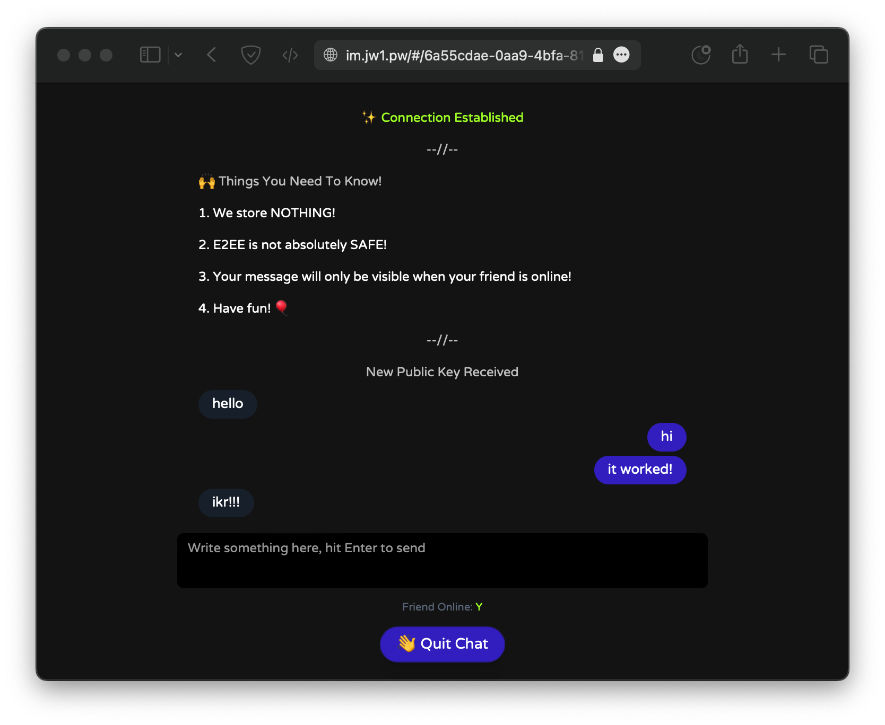

# M42

**m42** (message for two) is an Instant Messaging App.



_currently in development._

## Features

- 🔐 end-to-end encryption
- ☝️ no group chat, 1-on-1 only
- 😎 no chat history stored
- 🫣 no login needed
- 🫡 1-end session
- ☠️ self-destroy room when no activity
- ⚙️ easy deploy

## Deploy

### Prerequisites

- nodejs 12+
- npm 6+

```bash
# clone repo
git clone https://github.com/jw-12138/m42.git
cd m42

# copy `env_temp` to `.env`
# Linux / macOS
cp env_temp .env
# Windows
copy env_temp .env

# install dependencies
npm i

# build m42
npm run build

# run m42 server
npm run serve
```

now visit `localhost:5008`, enjoy!

---

## development

### first stage

- [x] UI
- [x] send text
- [x] security
  - [x] self-destroy when no activity
  - [x] 1-end session
  - [x] end-to-end encryption

### second stage

- [x] send images
- [ ] user selectable theme
- [ ] push notification
- [ ] notification sound
